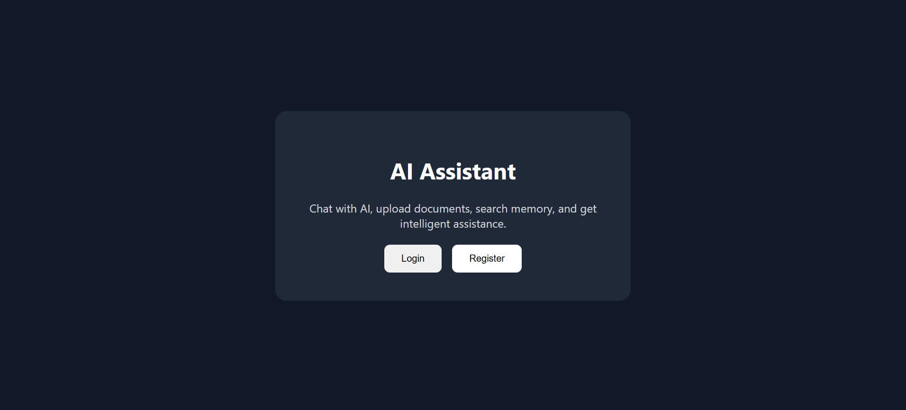
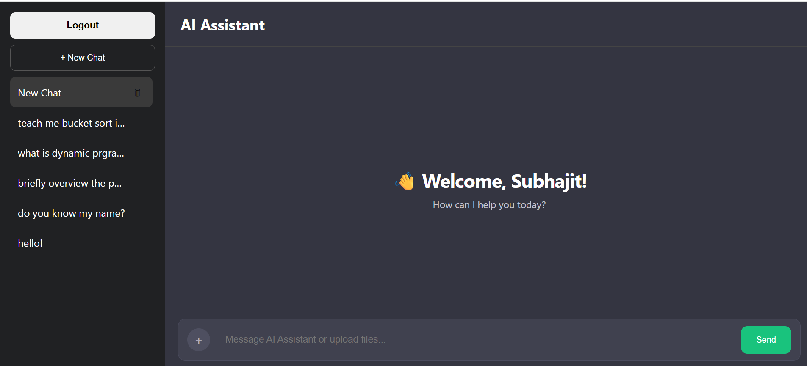
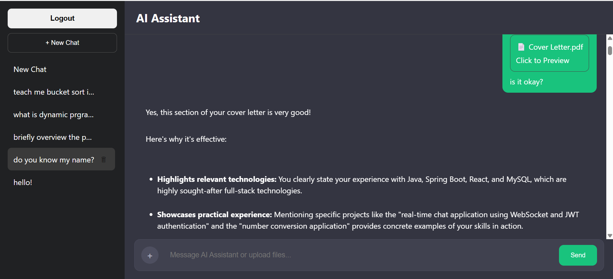

# AI Assistant Chatbot

A full-stack AI-powered assistant built with **Spring Boot**, **React**, **PostgreSQL + pgvector**, and **Google Gemini**.

## 🚀 Live Demo

https://ai-assistant-chatboat.vercel.app/

## Screenshots

<p align="center">
  
  
  
  
</p>

## ✨ Features

- JWT Authentication
- Google Gemini Integration
- Streaming AI Responses (SSE)
- Long-term Memory System
- RAG with pgvector
- PDF, TXT and Image Uploads
- Semantic Search
- Cloudinary Storage
- Mobile Responsive Design
- Vercel + Render + Neon Deployment

## 🏗️ Architecture

```text
React Frontend (Vercel)
        │
        ▼
Spring Boot Backend (Render)
        │
        ├── Gemini API
        ├── Cloudinary
        └── PostgreSQL + pgvector (Neon)
```

## 🛠️ Tech Stack

### Frontend
- React
- React Router
- Axios
- React Markdown

### Backend
- Java 17
- Spring Boot
- Spring Security
- JWT
- Spring AI
- Maven

### Database
- PostgreSQL
- pgvector
- Hibernate

### Deployment
- Vercel
- Render
- Neon

## 🔐 Environment Variables

```env
GEMINI_API_KEY=

DB_URL=
DB_USERNAME=
DB_PASSWORD=

CLOUDINARY_CLOUD_NAME=
CLOUDINARY_API_KEY=
CLOUDINARY_API_SECRET=

JWT_SECRET=
```

## 🏃 Getting Started

### Backend
1. Configure your environment variables.
2. Run: `./mvnw clean spring-boot:run`

### Frontend
1. Run: `npm install`
2. Run: `npm start`

## 👨‍💻 Author

**Subhajit Acharya**

GitHub: https://github.com/SubhajitAcharya-123

LinkedIn: https://www.linkedin.com/in/subhajit-acharya-288943344/
